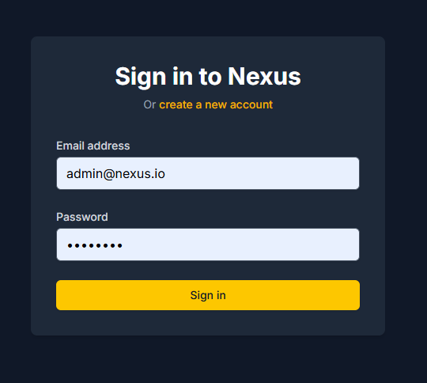
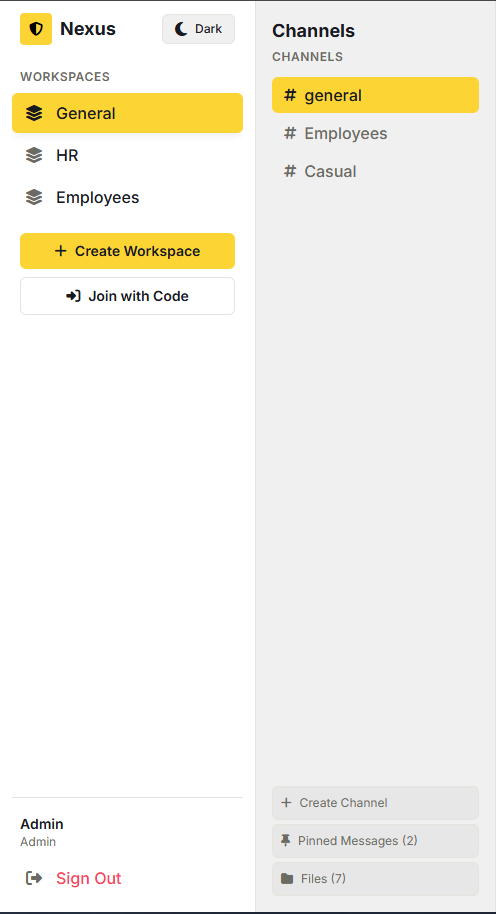
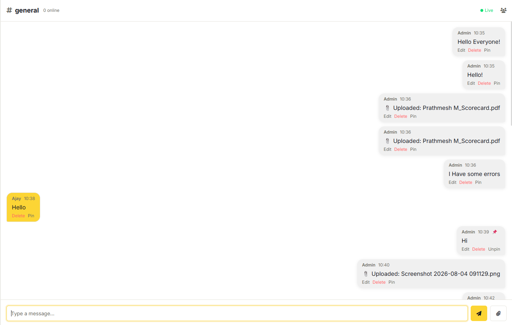
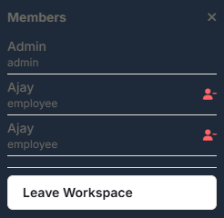
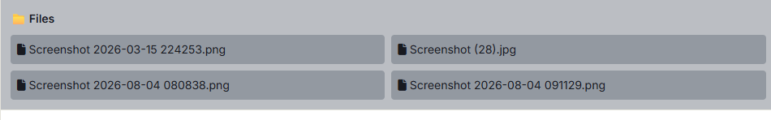
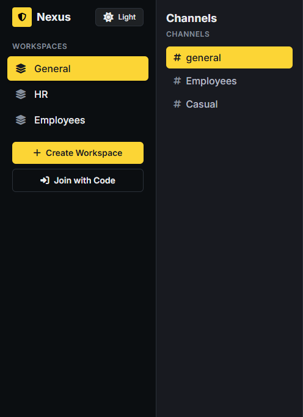

# 🚀 Nexus Workspace – Real-Time B2B Collaboration Platform

[](https://reactjs.org/)
[](https://www.typescriptlang.org/)
[](https://vitejs.dev/)
[](https://nodejs.org/)
[](https://expressjs.com/)
[](https://socket.io/)
[](https://mongodb.com/)
[](https://tailwindcss.com/)
[](https://opensource.org/licenses/MIT)

> A full-featured real-time collaboration platform for modern teams — workspaces, channels, live chat, file sharing, and admin controls, built with the MERN stack + Socket.IO.

---

## 📌 Table of Contents

- [Overview](#-overview)
- [Features](#-features)
- [Tech Stack](#-tech-stack)
- [Architecture](#-architecture)
- [Installation & Setup](#-installation--setup)
- [Running the Application](#-running-the-application)
- [Core Workflows](#-core-workflows)
- [Screenshots](#-screenshots)
- [Roadmap](#-roadmap)
- [Contributing](#-contributing)
- [License](#-license)

---

## 🧾 Overview

**Nexus Workspace** is a secure, real-time collaboration platform designed to bring remote teams together. It combines instant messaging, structured workspaces, and document sharing — all within an authenticated, role-specific web application.

Users can create or join workspaces, communicate via real-time channels, share files, and leverage admin controls to manage members and content. Built with modern technologies, it delivers a seamless, app-like experience without full-page reloads.

---

## ✨ Features

### 🏢 Workspaces
- **Create & Join** – Create new workspaces with custom invite codes or join existing ones.
- **Members Management** – View all members, their roles, and online status.
- **Leave Workspace** – Any member can leave a workspace at any time.
- **Admin Controls** – Admins can remove members from the workspace.

### 💬 Channels
- **Create Channels** – Any workspace member can create new channels.
- **Channel Categories** – Organize channels under logical groups (e.g., "Engineering", "Social").
- **Pinned Messages** – Admins can pin important messages for quick access.

### 📨 Real-Time Chat
- **Live Messaging** – Instant message delivery via Socket.IO.
- **Message Editing** – Edit your messages with an "(edited)" tag.
- **Message Deletion** – Delete your own messages; admins can delete any message.
- **Markdown Support** – Bold, italic, code blocks, inline code, and links.
- **Typing Indicators** – See when others are typing in real time.
- **Online Presence** – Live user online/offline status.

### 📎 File Sharing
- **File Uploads** – Upload files to any channel.
- **Downloadable Links** – Click any uploaded file to download it.
- **Files Tab** – Centralized file list per channel.

### 👑 Admin Controls
- **Pin/Unpin Messages** – Highlight important messages.
- **Remove Members** – Remove users from the workspace.
- **Create Workspaces** – Only admins can create new workspaces.
- **Audit Logs** *(future)* – Track who created/deleted channels, removed members, etc.

### 🎨 User Experience
- **Dark/Light Theme** – Toggle between dark and light modes.
- **Responsive Design** – Works on desktop and mobile devices.
- **Real-Time Notifications** *(future)* – @mentions and reply notifications.

---

## 🛠️ Tech Stack

| Category       | Technology                              |
|-----------------|------------------------------------------|
| Frontend        | React 19, TypeScript, Vite 5             |
| Styling         | Tailwind CSS v4, CSS Variables           |
| Backend         | Node.js, Express.js, TypeScript          |
| Database        | MongoDB (Atlas or Local)                 |
| Real-Time       | Socket.IO, Redis (optional)              |
| Authentication  | JWT, bcryptjs                            |
| File Uploads    | Multer                                   |
| Markdown        | React Markdown, remark-gfm               |

---

## 🧱 Architecture

- **Frontend** – React 19 with Vite for blazing-fast HMR and TypeScript for type safety.
- **Backend** – Express.js with a clean MVC-like structure, JWT authentication, and role-based access control.
- **Real-Time Layer** – Socket.IO for persistent WebSocket connections; Redis for pub/sub scaling (optional).
- **Database** – MongoDB with Mongoose ODM for flexible, scalable data modeling.
- **File Storage** – Multer handles file uploads; files are stored on the server's filesystem.

---

## 📦 Installation & Setup

### Prerequisites
- Node.js 18+
- npm or yarn
- MongoDB (local or Atlas)
- Redis (optional – falls back to in-memory)

### 1. Clone the repository
```bash
git clone https://github.com/yourusername/nexus-workspace.git
cd nexus-workspace
```

### 2. Install dependencies
```bash
# Install server dependencies
cd server
npm install

# Install client dependencies
cd ../client
npm install
```

### 3. Configure environment variables
```bash
# Server
cp server/.env.example server/.env
# Edit .env with your MongoDB URI and JWT secret

# Client (optional – defaults work)
cp client/.env.example client/.env
```

### 4. Database setup
```bash
# Ensure MongoDB is running locally or use Atlas
# The app will auto-create collections on first run
```

---

## 🚀 Running the Application

### 1. Start the backend server
```bash
cd server
npm run dev
```
Server runs on `http://localhost:5000`.

### 2. Start the frontend client
```bash
cd client
npm run dev
```
Client runs on `http://localhost:5173`.

### 3. Access the application
Open `http://localhost:5173` in your browser.

## 🔄 Core Workflows

| Actor   | Action              | Description                                                        |
|---------|----------------------|----------------------------------------------------------------------|
| User    | Register             | Creates a new account with name, email, and password.               |
| User    | Login                | Authenticates using JWT and redirects to the dashboard.             |
| Admin   | Create Workspace     | Creates a new workspace with a custom or auto-generated invite code.|
| User    | Join Workspace       | Joins an existing workspace using an invite code.                   |
| User    | Create Channel       | Creates a new channel within the current workspace.                 |
| User    | Send Message         | Sends a real-time message in the active channel.                    |
| User    | Edit Message         | Edits their own message (appears instantly for all users via socket).|
| Admin   | Pin/Unpin Message    | Highlights or removes highlight from a message.                     |
| User    | Upload File          | Shares a file in the channel (sent as a download link).             |
| Admin   | View Members         | Sees all members in the workspace with their roles.                 |
| Admin   | Remove User          | Removes a member from the workspace.                                 |
| User    | Leave Workspace      | Leaves the current workspace (removes themselves).                  |
| User    | Toggle Theme         | Switches between dark and light modes.                              |

---

## 📸 Screenshots

- **Login Page**
  

- **Dashboard – Workspaces**
  

- **Chat Interface**
  

- **Members Dropdown**
  

- **File Upload**
  

- **Dark/Light Theme**
  

---

## 🗺️ Roadmap

- [x] User authentication (JWT + bcrypt)
- [x] Workspace management (create, join, leave)
- [x] Channel management (create, browse)
- [x] Real-time messaging (Socket.IO)
- [x] Message editing & deletion
- [x] File uploads & sharing
- [x] Pinned messages (admin only)
- [x] Members list with roles
- [x] Admin remove user
- [x] Dark/Light theme
- [ ] @Mentions with notifications
- [ ] Threaded replies
- [ ] Message reactions (emojis)
- [ ] Email notifications
- [ ] User presence status (Online/Away/DND)
- [ ] Audit logs for admin
- [ ] Multi-workspace support with tabs

---

## 🤝 Contributing

Contributions are welcome! Please follow these steps:

1. Fork the repository.
2. Create a new branch: `git checkout -b feature/your-feature`.
3. Commit your changes: `git commit -m 'Add some feature'`.
4. Push to the branch: `git push origin feature/your-feature`.
5. Open a Pull Request.

Please ensure your code adheres to the existing style and includes appropriate tests.

---

## 📄 License

This project is licensed under the MIT License – see the [LICENSE](LICENSE) file for details.

---

[GitHub](https://github.com/yourusername) · [LinkedIn](https://linkedin.com/in/yourusername) · [Portfolio](https://yourportfolio.com)
